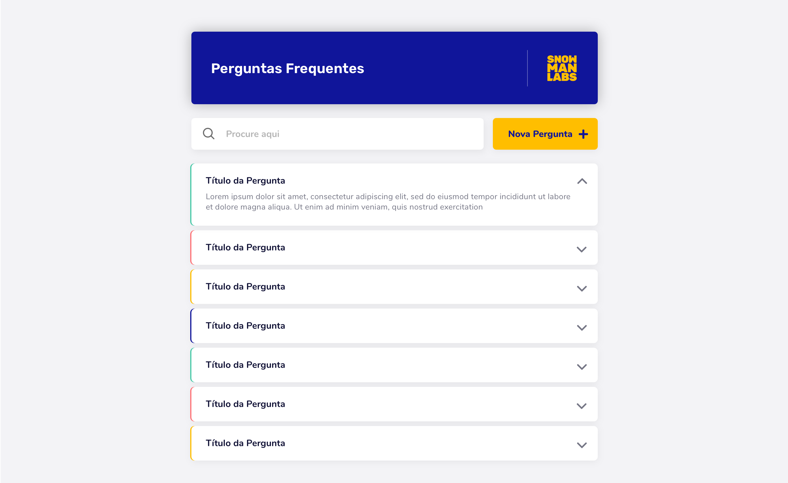

 

  

  <h3 align="center">Front-End Challenge :trophy:</h3>

  

    :suspect: How do you solve problems? :godmode:
     
     
    <a href="https://www.snowmanlabs.com.br/snow-team/">SnowTeam</a>
    ·
    <a href="https://groups.google.com/a/snowmanlabs.com/forum/#!forum/dev.challenge">Questions about the challenge</a>
    ·
    <a href="https://invis.io/5QZR5W4HBXG">All InVision Screens</a>
  

## Table of Contents
- [Challenge Description](#challenge-description)
  - [Goal](#goal)
  - [Requirements](#requirements)
  - [User Stories](#user-stories)
  - [Deliverables](#deliverables)
  - [Evaluation](#evaluation)
  - [Bonus Deliverable](#bonus-deliverable)
  - [Questions?](#questions)

# Challenge Description

     
    
     
    <a href="https://invis.io/5QZR5W4HBXG">
        All InVision Screens »
    </a>
     

We want to understand you better, so do not be afraid of failing, this is not a matter of right and wrong. Just do your best. Good luck! :smile:

## Goal

:snowman: Your team is developing an application and needs to implement a new feature, a Frequently Asked Questions page, and you were assigned to develop this feature.

## Requirements

* You must use our FAQ API (available [here](https://snow-faq-api.herokuapp.com/api/v1/questions/)) for backend requests. It has GET and POST, and auto deletes its updates by each X minutes
* You may use plain **Javascript**, but we encourage you to use **TypeScript** if you feel comfortable to.
* You may choose to use a framework (we use Vue.js here, but if you feel more confident using another one, no problem). If you are feeling really :godmode: badass, do it vanilla.
* You may use a CSS Preprocessor, *webpack*, *Babel* and other tools.
* We encourage you to use a UI framework. The less CSS you write, the better.
* You may use any piece of technology you might find necessary (or cool).
* It must be built in *components*. We are very focused on componentization.
* It must be easy to setup and deploy. :children_crossing:
* Use **Nunito** and **Rubik** font families.
* Do your best.

## User Stories

* As a user, I want to see a list of questions and answers (FAQ).
* As a user, I want the answer to show when I click on a question.
* As a user, I want to be able to search for a question/answer.
* As a user, I want to be able to create a new question/answer.
* As a user, I want to add a color to a question/answer.

## Deliverables

* The source code in a public git repository.
* A public live demo.
* Instructions on how to run the development environment.
* Instructions on how to deploy.

## Evaluation

The evaluation will follow the criteria below.

* :dart: Good practices.
* :wrench: Code maintainability.
* :rocket: Performance.
* :watch: Full operation.
* :factory: Robustness.
* :earth_americas: Scalability.

## Bonus Deliverable

We would really enjoy if you would take us through your decision making process in some way. It doesn't need to be deep, just a general glance of it. As a bonus, if you are feeling like an [awesome developer streamer](https://github.com/bnb/awesome-developer-streams) :blush: :tv:, we would like to see a video of your development process. It would allow us to better understand you and give you a more complete feedback.

## Questions?

If you have any questions about this challenge, you can open a new topic or search for your question at the [Dev Challenge Forum](https://groups.google.com/a/snowmanlabs.com/forum/#!forum/dev.challenge). :love_letter:
